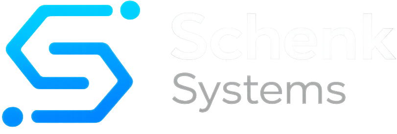

  

  <h3>Prozessautomatisierung, die einfach funktioniert.</h3>
  
<strong>Nils Schenk</strong> · Gründer &amp; Entwickler bei Schenk-Systems

  

    Wir verbinden Ihre Systeme und automatisieren wiederkehrende Arbeitsschritte 
    mit n8n und Zapier - und entwickeln individuelle Software, wenn Standardtools nicht ausreichen.
  

  

    <a href="https://schenk-systems.de">🌐&nbsp;Website</a>
    &nbsp;·&nbsp;
    <a href="mailto:info@schenk-systems.de">✉️&nbsp;Kontakt</a>
  

 

### Was wir bauen

- 🔁 **n8n-Automatisierung** - individuelle Workflows, selbst gehostet oder in der Cloud
- ⚡ **Zapier-Automatisierung** - schnelle Integration bestehender Tools ohne großen Aufwand
- 🧭 **Prozessautomatisierung** - Analyse bestehender Prozesse und echtes Automatisierungspotenzial
- 🔌 **Systemintegration** - CRM, E-Mail, Datenbanken, Formulare, Slack, Notion, Google Workspace
- 🤖 **KI-Automatisierung** - KI-gestützte Schritte gezielt in bestehende Workflows integriert
- 💻 **Individuelle Software** - wenn n8n oder Zapier nicht reichen, entwickeln wir maßgeschneiderte Lösungen

 

### Tech, mit dem wir arbeiten

  
  
  
  
  

 

  📍 Wallenhorst, Deutschland

